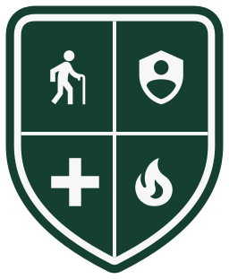
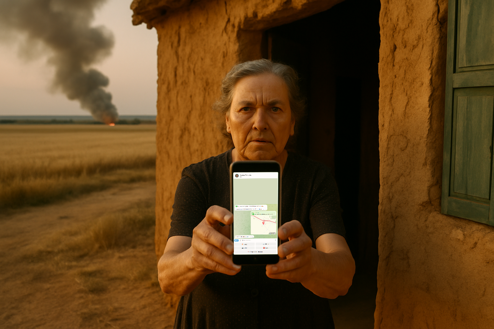
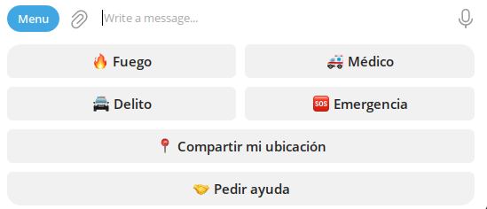

  

<h1 align="center">Escudo</h1>

<strong>Comunidades que responden · Communities that respond</strong>

An open, reusable model for **community-organised emergency response**, built by
and for small villages. Born in Bercianos del Real Camino, León — two hundred
residents, most of them well past sixty — and designed to be adopted and adapted
by any village or group.

**The full model lives at [escudo.red](https://escudo.red)** — philosophy,
protocols, worldwide examples, the technology, and every piece of artwork, in
Spanish and English. This repository is its source: the website, the alert
software, and the canonical graphics library.

## The first ten minutes

Someone falls in the kitchen and can't reach the phone. A field catches in
August. A man in a hi-vis vest talks his way into a house, saying he's come to
read the meter.

The health centre is eleven kilometres away, the hospital forty-seven, and one
Guardia Civil post covers dozens of villages. They will come, and they are
always called first — but somebody arrives before them, and that somebody is a
neighbour. **Escudo is how a village responds on purpose rather than by luck.**

  

It is four things:

- **The Red Escudo** — the people. Neighbours who said yes in advance: yes,
  wake me; yes, I'll go.
- **The button** — one button that reaches all of them at once. A phone for
  those who have one; a wall button or a pendant for those who can't work one.
- **The Protocol** — observe and report, 062 or 112 first, behaviour and
  vehicles never origins, and never intervene, pursue or detain.
- **The signage** — a sign at the entrance, a plaque on a wall, a sticker in a
  window. Free to download and adapt.

And three things it is not: **not a patrol** (citizen patrols have no legal
cover in Spain — every serious scheme in the world is eyes, ears and hands),
**not a replacement for 062 and 112** (every alert carries both numbers), and
**not a register of the vulnerable** (a name and a way to reach it, nothing
more).

## The alert layer, live today

A Telegram bot gives every neighbour a personal *Botón Escudo*: four alarm
categories that wake the village, one quiet tier that doesn't, dedupe for
panic-pressing, location sharing, an incident log with GDPR retention. Free, no
app to install, running in Bercianos now.

  

Adopting it for your village is [one YAML file and two environment
variables](tech-implementation/bot/README.md) — village name, language, your
national emergency numbers, your buttons. No code changes.

## What's in this repository

| Directory | What it is |
| --- | --- |
| [`website/`](website/) | The [escudo.red](https://escudo.red) site (Hugo, ES + EN). The site *is* the model: philosophy, how it works, protocols, evidence, runbooks. |
| [`tech-implementation/bot/`](tech-implementation/bot/) | The Telegram alert bot (Deno, MIT). Plus the device bridge for pendants and dumb phones, and the admin panel. |
| [`graphics/`](graphics/) | The canonical artwork library: crest, signage, stickers, Telegram icons, diagrams — all generated from scripts, all reusable. |
| [`research/`](research/) | The commissioned landscape survey: worldwide schemes, the honest evidence, Spanish legal ground. |

## The three rules that aren't negotiable

Everything else is a village's to change. These aren't, because they are what
keeps a Red Escudo legal and worth belonging to:

1. **Call 062 or 112 first.** Escudo supplements the authorities, never
   replaces or bypasses them.
2. **Observe, report, help — never intervene, pursue or detain.**
3. **Behaviour and vehicles, never ethnicity or origin.** No photographs of
   people, ever.

## Licensing

- **Software** ([`tech-implementation/`](tech-implementation/)) — [MIT](tech-implementation/bot/LICENSE).
- **Content and artwork** (`website/`, `graphics/`, `research/`) —
  [CC BY-SA 4.0](https://creativecommons.org/licenses/by-sa/4.0/): take it,
  translate it, put your own village's name on it; share what you improve.
- The crest uses [Material Design Icons](https://github.com/google/material-design-icons)
  (Apache-2.0); fonts are Bricolage Grotesque and Public Sans (OFL).
  Externally sourced photos are credited in
  [`graphics/photos-external/CREDITS.md`](graphics/photos-external/CREDITS.md).

## Languages

English is the source of truth; Spanish is the version Bercianos reads. Every
page of the site exists in both. To add a language to the bot, translate one
file — [how](tech-implementation/bot/README.md).

---

*Started in Bercianos del Real Camino. Take what works, change the rest.*
