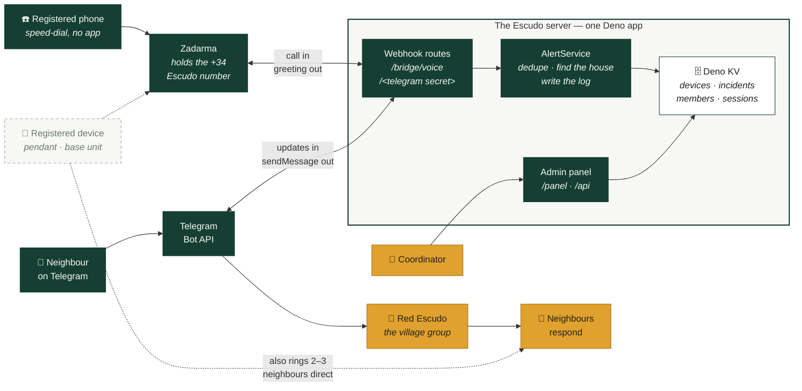

# Technical implementation

Get an alert from the person who needs help to the neighbours who can give it, in
seconds. No app to install, no dashboard, no accounts, no control room.

**One alert path, three doors.** However an alarm is raised it becomes the same
message, in the same village group, in the same format:

Solid lines are built and in use. The dashed line is written and tested, and goes
live the day a household has a device worth registering.

**The Telegram bot is not the centre of this system.** It is one way in and the
way messages get out — a transport, not a router. The centre is a single small
program, the Escudo server, and everything else plugs into it:

- **Two inbound webhooks, one process.** Telegram POSTs button presses to a
  secret path; Zadarma POSTs an incoming call to `/bridge/voice`. The bridge
  verifies a signature on every request and is not mounted at all without the
  key, because an open bridge is a phone number anyone can use to wake the
  village.
- **`AlertService` is where an alarm becomes an alert** — it dedupes repeat
  presses, turns a phone number into a household and an address, writes the
  incident, and hands the finished message to Telegram to post.
- **The alarm goes out while the phone is still ringing.** Zadarma notifies at
  ring, not at pickup, so someone who panics and hangs up after two rings has
  already raised the village. Only afterwards is the call answered, with a
  recorded message: *aviso recibido, viene ayuda*. A ring-out tone tells a
  frightened person on the floor nothing, and invites them to hang up and try
  again; a voice is the difference between hoping it worked and knowing.
- **The admin panel is part of the same program**, but deliberately not part of
  the alert path: it shares the database and nothing else, and the alert routes
  are matched before it, so a panel page failing cannot delay an alarm.
- **A device's other calls skip all of this.** After ringing the Escudo number it
  dials two or three neighbours directly, over the ordinary phone network. That
  call is the acknowledgment, and it works even if this server is down.

The doors exist because they serve different people:

| Door | Who it's for | What it costs |
|---|---|---|
| **Telegram** | Anyone with a smartphone who uses it | Nothing |
| **A registered phone** | Has a phone, isn't on Telegram — a dumbphone, or a smartphone used only for calls | Nothing |
| **A registered device** | Can't work a phone in a crisis, or is unconscious | The family buys it |

Nothing downstream branches on which door an alarm came through. A call from a
registered number becomes an ordinary alert, with the same dedupe, the same
false-alarm button, the same log.

## Where it stands

**[The Telegram layer]() is built and in
use.** One button, the whole village knows. It costs nothing to run, works on any
phone, and a community adopts it by editing one configuration file.

**[The phone layer]() is live.** Bercianos has
a León number, and calling it raises the village group. It covers everyone a
smartphone doesn't: the neighbour who has a phone but not Telegram, and the
person who can't work a phone while lying on the kitchen floor. Escudo doesn't
sell or choose hardware — it publishes one requirement, *it must be able to call
a stored number*, and anything meeting it can join.

What remains is hardware, not software. No pendant or base unit has been bought
and proven in a real house yet, and until one has, nothing here recommends a
model. Registering the phones people already own needs none of it and covers the
largest group in the village.

## Rollout

1. **Telegram only, no hardware.** Cost: nothing. *Done.*
2. **Register the phones people already own.** No purchase, no fitting, and it
   reaches the largest group in the village. This is the cheapest useful thing
   the village can do.
3. **Devices, one household at a time**, as and when a family decides one is
   worth it — [chosen with the person](),
   never handed out from a list.

Running through all three is the
[test rota](#the-test-rota).
A shop-bought device reports nothing about itself: it sits in a drawer, the SIM
expires, the battery dies, and the village finds out on the day it matters. A
scheduled test is the only proof a device still works, so the bot keeps that rota
rather than trusting anyone to remember.

The hard problems aren't technical: phones on silent at three in the morning,
false alarms that feel embarrassing, people waiting rather than being a nuisance.
Better hardware fixes none of them.
