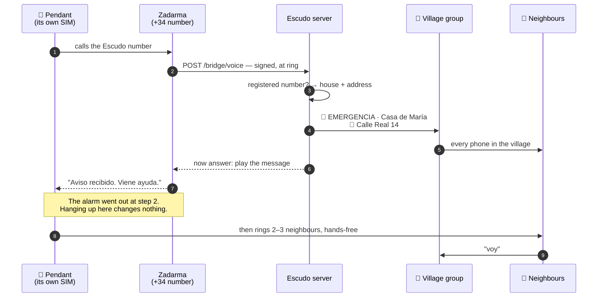

# The Escudo number

One ordinary Spanish phone number, held by the village. Every registered device
and every registered phone stores it, and the bot answers it.

**The alarm is raised before the call is answered.** The network tells the server
a call is coming in while the phone is still ringing, so the village is already
moving. Someone who panics and hangs up after two rings has raised it just the
same. Nothing depends on them staying on the line.

**Then it is answered, and says so.** A recorded message, then the line clears:
*aviso recibido, viene ayuda*. A ring-out tone tells a frightened person on the
floor nothing, which invites hanging up and redialling and giving up. A voice is
the difference between hoping it worked and knowing. It comes after the alarm on
purpose — if the recording fails, the village has already been raised.

Answering costs the caller a few cents on a prepaid tariff, and nothing at all on
any contract where landline minutes are bundled. That is the right way round: the
money buys the reassurance, never the alert.

**Only registered numbers raise the village.** Anything else goes to the
coordinator instead, never to the group — otherwise the alarm belongs to whoever
guesses the number. It isn't ignored either, because a number nobody recognises
is usually a device somebody installed and never finished setting up.

The number costs the village about €1.70 a month, billed yearly — roughly €20 a
year, and the only running cost in the entire system. Ten lines come with it, so
a village-wide event with several people ringing at once doesn't queue. Getting
one in Spain is a matter of paperwork rather than money: the numbering rules
require a tax ID and an address in the village. **Bercianos has had a León number
since July 2026.**

## What actually happens, in order

A pendant is pressed. This is every hop, and there are fewer than people expect:

**Two seconds to the group**, and the slow parts are the mobile network and
Telegram, neither of which we control. The greeting comes after that, not before.

## Why a call, and not a text

Sending an SMS is six fine-motor steps: find the phone, unlock it, open messages,
find the contact, type, send. Every one of them is a chance to fail at four in
the morning. A call is one step, and on a dumbphone it's a speed-dial key held
down with a thumb. That alone would be reason enough.

**In Spain there is no choice anyway.** No +34 number can receive an SMS from a
device like this — inbound A2P texts route over short codes, which take months to
provision and are priced for enterprises. Every provider selling a Spanish number
sits behind the same numbering policy, so shopping around doesn't fix it.

The cost is the location pin: a device that texts its coordinates has nowhere to
send them. Alerts carry the registered house and address instead, which in a
village this size is most of what a pin would have said.

## The device's own calls do a different job

An alarm device of this class rings several stored numbers in turn. Escudo uses
that on purpose:

- **The first number is the Escudo number.** It needs nobody to answer it or even
  be awake, and it raises the whole village.
- **The rest are responders.** Someone answers, and — because these units are
  hands-free at several metres — talks to the person while they're still on the
  floor.

**That call is the acknowledgment**, and it's a better one than any recording can
give. A message tells you the system worked. A neighbour's voice tells you
somebody is coming, and gets the two things that decide what happens next: what's
wrong, and whether to ring 112 now.

Two channels, two failure modes, no overlap.

## One press, no category

An alarm raised this way carries who and where, not what kind. It arrives as the
general emergency, and the answer comes from the phone call and the neighbour at
the door, not from a menu nobody can operate face-down on the tiles.

**Where matters, because a box on a kitchen wall has no GPS.** So the registry
holds the address — that's the payload, not paperwork. It records that a number
belongs to a house. It records nothing about anyone's health, and there is no
field where that could be written down.

## Never guessing

The rule inside the software is blunt on purpose: **any contact from a registered
number is an alarm.** Not a call that lasted long enough, not one that rang the
right number of times. The caller is on the floor or they are not, and the system
is in no position to judge which.

The same rule is why nothing tries to read a message and decide. Devices phrase
things differently and firmware changes without warning, so a pendant that starts
sending `SOS ALM 01` instead of `EMERGENCIA` must not go quiet. Where a message
can be received at all, it is read only to add detail — a position becomes a map
pin — never to decide whether to raise the alarm.

There is exactly one exception, because it bites. Several devices send a
low-battery text, and under the blunt rule that's a village-wide siren at three
in the morning — which teaches people to mute the group, the worst outcome in the
whole system. Those go to the coordinator instead. Anything unrecognised still
raises the alarm.

That handling is written, tested, and dormant in Spain, where nothing can deliver
a text to the number. It is ready for anywhere that can.

## What this layer doesn't solve

Stated plainly, because the rest of the design works around it:

- **A shop-bought device tells us nothing about itself.** No battery telemetry,
  no heartbeat, no way to see that it went quiet three months ago. The only proof
  a device still works is a
  [scheduled test](#the-test-rota),
  which is why the bot keeps the rota rather than a person.
- **A mains base unit needs the mains.** Its internal backup is hours, not days.
  A phone in a pocket isn't affected.
- **A prepaid phone with no credit can't ring the Escudo number.** It can still
  ring 112, with no credit and no SIM — which is why the emergency numbers stay
  on every alert Escudo sends.
- **A prepaid SIM expires quietly.** Spanish prepago dies after four to nine
  months without a top-up, and nothing announces it. Whose SIM it is and when it
  was last topped up is the coordinator's job to know, not the family's.
