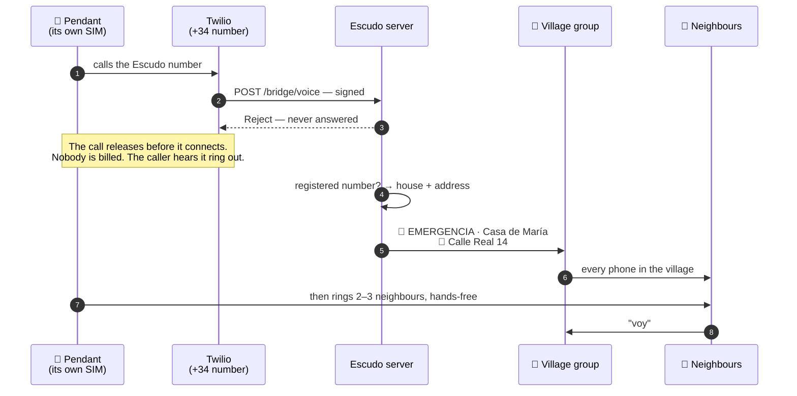

# The Escudo number

One ordinary Spanish phone number, held by the village. Every registered device
and every registered phone stores it, and the bot answers it.

**Ringing it is free.** The call is never picked up, and a call that is never
answered is a call nobody is billed for — not the village, and not the person
ringing. There is no credit to run down and no bill to be afraid of, which
matters more than it sounds: a device that costs something to use is a device
people hesitate over, and hesitation is the whole thing Escudo is trying to
remove.

**Only registered numbers raise the village.** Anything else goes to the
coordinator instead, never to the group — otherwise the alarm belongs to whoever
guesses the number. It isn't ignored either, because a number nobody recognises
is usually a device somebody installed and never finished setting up.

The number costs the village about a euro a month, and that is the only running
cost in the entire system. Getting one in Spain is a matter of paperwork rather
than money: the numbering rules require a tax ID and an address in the village,
which is the piece Bercianos is waiting on.

## What actually happens, in order

A pendant is pressed. This is every hop, and there are fewer than people expect:

The SMS, where the device sends one, runs the same path to `/bridge/sms` a second
or two later. It doesn't raise a second alarm — the server folds it into the one
the call already raised — but if it carries a position, a map pin appears under
the alert.

**Two seconds, end to end**, and the slow parts are the mobile network and
Telegram, neither of which we control.

## A missed call is an alarm

A call from a registered number is treated exactly like a text, and **it is never
answered**.

Sending an SMS is six fine-motor steps: find the phone, unlock it, open messages,
find the contact, type, send. Every one of them is a chance to fail at four in
the morning. A call is one step, and on a dumbphone it's a speed-dial key held
down with a thumb.

Not answering means it costs nothing to raise — no credit spent, no conversation
to start, nothing to explain. Ring and hang up, and the village is already
moving.

## A call and an SMS do different jobs

An alarm device of this class does both at once, to the same stored numbers.
Escudo uses that on purpose:

- **The SMS goes to the Escudo number.** It needs nobody to answer it or even
  be awake, and it raises the whole village.
- **The calls go to responders.** Someone answers, and — because these units are
  hands-free at several metres — talks to the person while they're still on the
  floor.

**That call is the acknowledgment**, and it's a better one than any device can
give. A beep tells you the box worked. A neighbour's voice tells you somebody is
coming, and gets the two things that decide what happens next: what's wrong, and
whether to ring 112 now.

Two channels, two failure modes, no overlap.

## One press, no category

An alarm raised this way carries who and where, not what kind. It arrives as the
general emergency, and the answer comes from the phone call and the neighbour at
the door, not from a menu nobody can operate face-down on the tiles.

**Where matters, because a box on a kitchen wall has no GPS.** So the registry
holds the address — that's the payload, not paperwork. It records that a number
belongs to a house. It records nothing about anyone's health, and there is no
field where that could be written down.

## Never guessing

The rule inside the software is blunt on purpose: **any contact from a registered
number is an alarm.** Not a message that reads like one — devices phrase things
differently and firmware changes without warning, so a pendant that starts
sending `SOS ALM 01` instead of `EMERGENCIA` must not go quiet.

The text is read only to add detail: a position in the message becomes a map pin
under the alert. It is never read to decide whether to raise it.

There is exactly one exception, because it bites. Several devices send a
low-battery SMS, and under the blunt rule that's a village-wide siren at three in
the morning — which teaches people to mute the group, the worst outcome in the
whole system. Those go to the coordinator instead. Anything unrecognised still
raises the alarm.

## What this layer doesn't solve

Stated plainly, because the rest of the design works around it:

- **A shop-bought device tells us nothing about itself.** No battery telemetry,
  no heartbeat, no way to see that it went quiet three months ago. The only proof
  a device still works is a
  [scheduled test](#the-test-rota),
  which is why the bot keeps the rota rather than a person.
- **A mains base unit needs the mains.** Its internal backup is hours, not days.
  A phone in a pocket isn't affected.
- **A prepaid phone with no credit can't ring the Escudo number.** A missed call
  costs nothing once it connects, but an empty phone can't place one at all. It
  can still ring 112, with no credit and no SIM — which is why the emergency
  numbers stay on every alert Escudo sends.
- **A prepaid SIM expires quietly.** Spanish prepago dies after four to nine
  months without a top-up, and nothing announces it. Whose SIM it is and when it
  was last topped up is the coordinator's job to know, not the family's.
