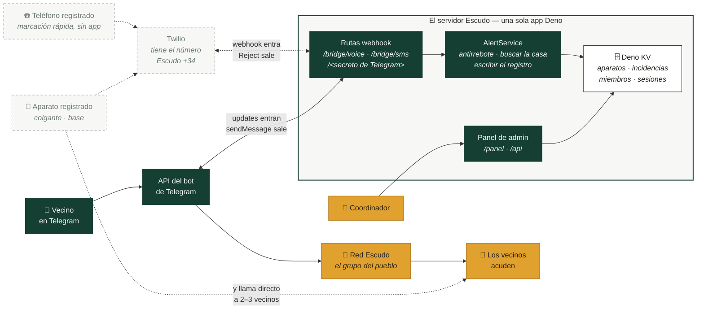

# Implementación técnica

Llevar el aviso desde quien necesita ayuda hasta los vecinos que pueden dársela,
en segundos. Sin aplicación que instalar, sin panel de control, sin cuentas, sin
sala de mando.

**Una vía de aviso, tres puertas.** Se dé la alarma como se dé, acaba siendo el
mismo mensaje, en el mismo grupo del pueblo y con el mismo formato:

Las líneas continuas están hechas y funcionando. Las discontinuas están escritas
y probadas, y entran en servicio el día que el pueblo tenga un número de teléfono
propio.

**El bot de Telegram no es el centro de este sistema.** Es una forma de entrar y
la forma en que salen los mensajes: un transporte, no un enrutador. El centro es
un solo programa pequeño, el servidor Escudo, y todo lo demás se enchufa a él:

- **Tres webhooks de entrada, un solo proceso.** Telegram manda las pulsaciones a
  una ruta secreta; Twilio manda las llamadas a `/bridge/voice` y los mensajes a
  `/bridge/sms`. Las rutas de Twilio comprueban una firma en cada petición y no
  se montan siquiera sin una clave, porque un puente abierto es un número de
  teléfono con el que cualquiera puede levantar al pueblo.
- **`AlertService` es donde una alarma se convierte en aviso**: descarta
  pulsaciones repetidas, convierte un número de teléfono en una casa y una
  dirección, escribe la incidencia y le pasa el mensaje ya montado a Telegram
  para que lo publique.
- **La llamada de voz no se coge nunca.** Lo que el servidor le responde al
  webhook de Twilio es un rechazo, que suelta la llamada antes de que se
  establezca: así no se le cobra a nadie y quien llama la oye dar tono.
- **El panel de administración es parte del mismo programa**, pero a propósito no
  es parte de la vía de aviso: comparte la base de datos y nada más, y las rutas
  de alarma se atienden antes que él, así que un fallo en una página del panel no
  puede retrasar una alarma.
- **Las otras llamadas del aparato se saltan todo esto.** Después de mandar el
  SMS al número Escudo, llama a dos o tres vecinos directamente, por la red
  telefónica de siempre. Esa llamada es el acuse de recibo, y funciona aunque
  este servidor esté caído.

Las puertas existen porque sirven a gente distinta:

| Puerta | Para quién | Qué cuesta |
|---|---|---|
| **Telegram** | Quien tiene móvil y lo usa | Nada |
| **Un teléfono dado de alta** | Tiene teléfono pero no Telegram: un móvil de teclas, o un smartphone que sólo se usa para llamar | Nada |
| **Un aparato dado de alta** | No puede manejar un teléfono en una urgencia, o está inconsciente | Lo compra la familia |

Nada de lo que viene después distingue por qué puerta entró un aviso. Una llamada
o un mensaje desde un número dado de alta se convierte en una alerta corriente,
con el mismo antirrebote, el mismo botón de falsa alarma y el mismo registro.

## Cómo está

**La [capa de Telegram]() está hecha y en
uso.** Un botón y se entera todo el pueblo. No cuesta nada mantenerla, funciona
en cualquier teléfono y una comunidad la adopta editando un solo archivo de
configuración.

**La [capa de teléfonos y aparatos]()
está escrita y probada, a la espera de un número de teléfono.** Cubre a todos los
que un smartphone no alcanza: el vecino que tiene teléfono pero no Telegram, y
quien no puede manejar un teléfono tirado en el suelo de la cocina. Escudo no
vende ni elige aparatos: publica un único requisito, *tiene que poder llamar o
mandar un SMS a un número guardado*, y sirve cualquier cosa que lo cumpla. El
registro, la vía de aviso y el panel de administración están hechos; lo que falta
es comprar el número, que en España es cuestión de un CIF y una dirección en el
pueblo más que de dinero.

## Despliegue

1. **Sólo Telegram, sin aparatos.** Coste: cero. *Hecho.*
2. **Dar de alta los teléfonos que la gente ya tiene.** Sin compras, sin
   instalar nada, y llega al grupo más numeroso del pueblo. Es lo más útil y más
   barato que se puede hacer.
3. **Aparatos, de casa en casa**, según una familia decida que le compensa:
   [elegidos con la persona](),
   nunca repartidos desde una lista.

Atravesando los tres está la
[rutina de pruebas](#la-rutina-de-pruebas).
Un aparato de tienda no cuenta nada de sí mismo: se queda en un cajón, la SIM
caduca, la pila se agota, y el pueblo se entera el día que hace falta. Una
prueba programada es la única forma de saber que sigue funcionando, así que la
lleva el bot en vez de fiarlo a que alguien se acuerde.

Los problemas difíciles no son técnicos: teléfonos en silencio a las tres de la
mañana, falsas alarmas que dan vergüenza, gente que se aguanta por no molestar.
Ningún aparato mejor arregla eso.
