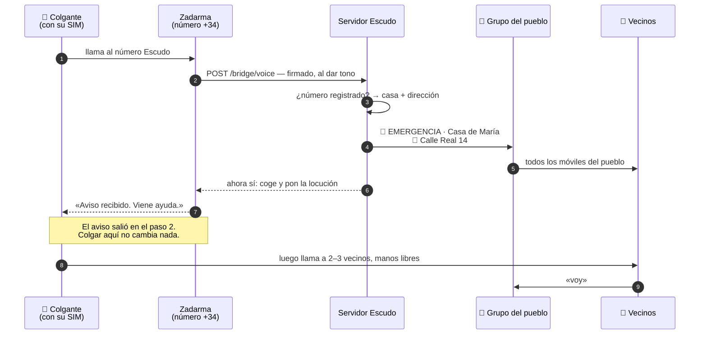

# El número Escudo

Un número de teléfono español corriente, del pueblo. Cada aparato y cada teléfono
dado de alta lo lleva guardado, y el bot es quien lo atiende.

**El aviso sale antes de que se coja la llamada.** La red le dice al servidor que
entra una llamada mientras el teléfono todavía está sonando, así que el pueblo ya
se está moviendo. Quien se asusta y cuelga a los dos tonos la ha dado igual. Nada
depende de que se quede al aparato.

**Después se coge, y lo dice.** Un mensaje grabado, y se corta la línea: *aviso
recibido, viene ayuda*. Un tono que se pierde no le dice nada a una persona
asustada en el suelo, y eso invita a colgar, a volver a llamar y a rendirse. Una
voz es la diferencia entre esperar que haya funcionado y saberlo. Va después del
aviso a propósito: si falla la locución, al pueblo ya se le ha avisado.

Cogerla le cuesta a quien llama unos céntimos con tarjeta prepago, y nada en
cualquier contrato con las llamadas a fijo incluidas. Y así es como tiene que
ser: el dinero paga la tranquilidad, nunca el aviso.

**Sólo los números dados de alta avisan al pueblo.** Cualquier otro va al
coordinador, nunca al grupo — si no, la alarma sería de quien acertase el número.
Tampoco se ignora: un número que no reconocemos suele ser un aparato que alguien
instaló y nunca terminó de configurar.

El número le cuesta al pueblo unos 1,70 € al mes, facturados por años —unos 20 €
al año, y es el único gasto corriente de todo el sistema. Trae diez líneas
simultáneas, así que un suceso que ponga a varios vecinos a llamar a la vez no
hace cola. Conseguirlo en España es cuestión de papeleo, no de dinero: la
normativa de numeración exige un CIF o NIF y una dirección en el pueblo.
**Bercianos tiene número de León desde julio de 2026.**

## Qué pasa exactamente, por orden

Se pulsa un colgante. Éstos son todos los saltos, y son menos de los que la gente
se imagina:

**Dos segundos hasta el grupo**, y lo lento son la red móvil y Telegram, que no
dependen de nosotros. La locución viene después de eso, no antes.

## Por qué una llamada, y no un mensaje

Mandar un SMS son seis movimientos finos: buscar el teléfono, desbloquearlo,
abrir los mensajes, encontrar el contacto, escribir, enviar. Cada uno es una
ocasión de fallar a las cuatro de la mañana. Llamar es uno, y en un móvil de
teclas es una tecla de marcación rápida apretada con el pulgar. Con eso ya
bastaría.

**En España, además, no hay elección.** Ningún número +34 puede recibir un SMS de
un aparato de éstos: los mensajes A2P entrantes van por números cortos, que
tardan meses en darse de alta y tienen precio de empresa. Todo el que vende un
número español está detrás de la misma norma de numeración, así que buscar otro
proveedor no lo arregla.

Lo que se pierde es el punto en el mapa: un aparato que manda sus coordenadas por
mensaje no tiene dónde mandarlas. Los avisos llevan en su lugar la casa y la
dirección dadas de alta, que en un pueblo de este tamaño es casi todo lo que
habría dicho un punto en el mapa.

## Las llamadas del aparato hacen otra cosa

Un aparato de esta clase llama por orden a varios números guardados. Escudo lo
aprovecha a propósito:

- **El primero es el número Escudo.** No hace falta que nadie lo coja ni que
  nadie esté despierto. Levanta a todo el pueblo.
- **Los demás son los vecinos.** Alguien las coge y —como estos aparatos son
  manos libres a varios metros— habla con la persona mientras sigue en el suelo.

**Esa llamada es el acuse de recibo**, y es mejor que el que pueda dar ninguna
locución. Un mensaje grabado te dice que el sistema funcionó. La voz de un vecino
te dice que alguien viene, y saca las dos cosas que deciden lo que pasa después:
qué ha ocurrido, y si hay que llamar al 112 ya.

Dos canales, dos formas de fallar, sin solaparse.

## Una pulsación, sin categoría

Un aviso dado así lleva quién y dónde, no de qué tipo. Llega como emergencia
general, y la respuesta sale de la llamada de teléfono y del vecino en la puerta,
no de un menú que nadie puede manejar boca abajo sobre las baldosas.

**El dónde importa, porque una caja en la pared de la cocina no tiene GPS.** Por
eso el registro guarda la dirección: es la carga útil, no papeleo. Deja constancia
de que un número pertenece a una casa. No deja constancia de nada sobre la salud
de nadie, y no hay ninguna casilla donde pudiera escribirse.

## Nunca adivinar

La regla dentro del programa es tosca a propósito: **cualquier contacto desde un
número dado de alta es una alarma.** No una llamada que haya durado lo bastante,
ni una que haya dado los tonos justos. La persona está en el suelo o no lo está,
y el sistema no está en condiciones de juzgar cuál de las dos.

Por la misma regla, nada intenta leer un mensaje y decidir. Cada aparato lo dice
de una manera y el firmware cambia sin avisar, así que un colgante que empiece a
mandar `SOS ALM 01` en vez de `EMERGENCIA` no puede quedarse mudo. Donde se pueda
recibir un mensaje, se lee sólo para añadir detalle —una posición se convierte en
un punto en el mapa— nunca para decidir si se da el aviso.

Hay exactamente una excepción, porque escuece. Varios aparatos mandan un mensaje
de batería baja, y bajo la regla tosca eso es una sirena en todo el pueblo a las
tres de la mañana — que es como se enseña a la gente a silenciar el grupo, lo
peor que puede pasar en todo el sistema. Ésos van al coordinador. Cualquier cosa
que no reconozcamos sigue dando la alarma.

Ese manejo está escrito, probado y dormido en España, donde nada puede entregar
un mensaje al número. Está listo para donde sí se pueda.

## Qué no resuelve esta capa

Dicho claro, porque el resto del diseño está montado alrededor de ello:

- **Un aparato de tienda no cuenta nada de sí mismo.** Ni nivel de batería, ni
  señal de vida, ni forma de ver que dejó de funcionar hace tres meses. La única
  prueba de que sigue funcionando es una
  [prueba programada](#la-rutina-de-pruebas),
  y por eso la rutina la lleva el bot y no una persona.
- **Una base enchufada necesita la corriente.** Su batería interna aguanta horas,
  no días. Un teléfono en el bolsillo no se ve afectado.
- **Un móvil de prepago sin saldo no puede llamar al número Escudo.** Sí puede
  llamar al 112, sin saldo y hasta sin SIM — por eso los números de emergencia
  siguen apareciendo en cada aviso que manda Escudo.
- **Una SIM de prepago caduca en silencio.** El prepago español muere a los cuatro
  o nueve meses sin recarga, y nada lo anuncia. De quién es la SIM y cuándo se
  recargó por última vez es cosa del coordinador, no de la familia.
