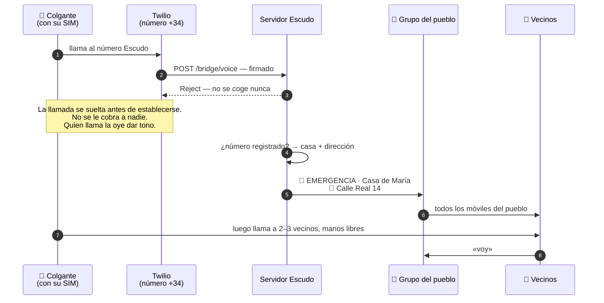

# El número Escudo

Un número de teléfono español corriente, del pueblo. Cada aparato y cada teléfono
dado de alta lo lleva guardado, y el bot es quien lo atiende.

**Llamarlo es gratis.** La llamada no se coge nunca, y una llamada que no se coge
no se le cobra a nadie: ni al pueblo, ni a quien llama. No hay saldo que gastar ni
factura que temer, y eso importa más de lo que parece: un aparato que cuesta
dinero usar es un aparato que la gente se piensa antes de tocar, y esa duda es
precisamente lo que Escudo intenta quitar de en medio.

**Sólo los números dados de alta avisan al pueblo.** Cualquier otro va al
coordinador, nunca al grupo — si no, la alarma sería de quien acertase el número.
Tampoco se ignora: un número que no reconocemos suele ser un aparato que alguien
instaló y nunca terminó de configurar.

El número le cuesta al pueblo alrededor de un euro al mes, y es el único gasto
corriente de todo el sistema. Conseguirlo en España es cuestión de papeleo, no de
dinero: la normativa de numeración exige un CIF o NIF y una dirección en el
pueblo, y es la pieza que falta en Bercianos.

## Qué pasa exactamente, por orden

Se pulsa un colgante. Éstos son todos los saltos, y son menos de los que la gente
se imagina:

El SMS, cuando el aparato manda uno, recorre el mismo camino hasta `/bridge/sms`
un segundo o dos después. No da una segunda alarma —el servidor lo une a la que
ya dio la llamada— pero si trae una posición, aparece un punto en el mapa debajo
del aviso.

**Dos segundos de punta a punta**, y lo lento son la red móvil y Telegram, que no
dependen de nosotros.

## Una llamada perdida es una alarma

Una llamada desde un número dado de alta se trata exactamente igual que un
mensaje, y **no se coge nunca**.

Mandar un SMS son seis movimientos finos: buscar el teléfono, desbloquearlo,
abrir los mensajes, encontrar el contacto, escribir, enviar. Cada uno es una
ocasión de fallar a las cuatro de la mañana. Llamar es uno, y en un móvil de
teclas es una tecla de marcación rápida apretada con el pulgar.

Que no se coja significa que dar el aviso no cuesta nada: ni saldo, ni una
conversación que empezar, ni nada que explicar. Llamar y colgar, y el pueblo ya
se está moviendo.

## Una llamada y un SMS hacen cosas distintas

Un aparato de esta clase hace las dos a la vez, a los mismos números guardados.
Escudo lo aprovecha a propósito:

- **El SMS va al número Escudo.** Incondicional, instantáneo y le da igual si hay
  alguien despierto. Levanta a todo el pueblo.
- **Las llamadas van a los vecinos.** Alguien las coge y —como estos aparatos son
  manos libres a varios metros— habla con la persona mientras sigue en el suelo.

**Esa llamada es el acuse de recibo**, y es mejor que el que pueda dar ningún
aparato. Un pitido te dice que la caja funcionó. La voz de un vecino te dice que
alguien viene, y saca las dos cosas que deciden lo que pasa después: qué ha
ocurrido, y si hay que llamar al 112 ya.

Dos canales, dos formas de fallar, sin solaparse.

## Una pulsación, sin categoría

Un aviso dado así lleva quién y dónde, no de qué tipo. Llega como emergencia
general, y la respuesta sale de la llamada de teléfono y del vecino en la puerta,
no de un menú que nadie puede manejar boca abajo sobre las baldosas.

**El dónde importa, porque una caja en la pared de la cocina no tiene GPS.** Por
eso el registro guarda la dirección: es la carga útil, no papeleo. Deja constancia
de que un número pertenece a una casa. No deja constancia de nada sobre la salud
de nadie, y no hay ninguna casilla donde pudiera escribirse.

## Nunca adivinar

La regla dentro del programa es tosca a propósito: **cualquier contacto desde un
número dado de alta es una alarma.** No un mensaje que parezca una alarma: cada
aparato lo dice de una manera y el firmware cambia sin avisar, así que un colgante
que empiece a mandar `SOS ALM 01` en vez de `EMERGENCIA` no puede quedarse mudo.

El texto sólo se lee para añadir detalle: una posición dentro del mensaje se
convierte en un punto en el mapa debajo del aviso. Nunca se lee para decidir si se
da el aviso o no.

Hay exactamente una excepción, porque escuece. Varios aparatos mandan un SMS de
batería baja, y bajo la regla tosca eso es una sirena en todo el pueblo a las tres
de la mañana — que es como se enseña a la gente a silenciar el grupo, lo peor que
puede pasar en todo el sistema. Ésos van al coordinador. Cualquier cosa que no
reconozcamos sigue dando la alarma.

## Qué no resuelve esta capa

Dicho claro, porque el resto del diseño está montado alrededor de ello:

- **Un aparato de tienda no cuenta nada de sí mismo.** Ni nivel de batería, ni
  señal de vida, ni forma de ver que dejó de funcionar hace tres meses. La única
  prueba de que sigue funcionando es una
  [prueba programada](#la-rutina-de-pruebas),
  y por eso la rutina la lleva el bot y no una persona.
- **Una base enchufada necesita la corriente.** Su batería interna aguanta horas,
  no días. Un teléfono en el bolsillo no se ve afectado.
- **Un móvil de prepago sin saldo no puede llamar al número Escudo.** Una llamada
  perdida no cuesta nada una vez que entra, pero un teléfono sin saldo no llega a
  hacerla. Sí puede llamar al 112, sin saldo y hasta sin SIM — por eso los números
  de emergencia siguen apareciendo en cada aviso que manda Escudo.
- **Una SIM de prepago caduca en silencio.** El prepago español muere a los cuatro
  o nueve meses sin recarga, y nada lo anuncia. De quién es la SIM y cuándo se
  recargó por última vez es cosa del coordinador, no de la familia.
